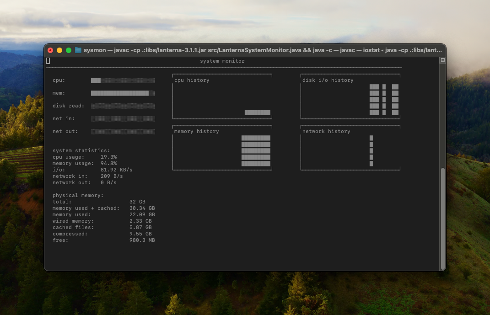

# README: Lanterna System Monitor

## Overview

`LanternaSystemMonitor` is a Java-based terminal application that displays real-time system statistics using
the [Lanterna](https://github.com/mabe02/lanterna) library. It provides a graphical and textual overview of key system
metrics, including:

- CPU usage
- Memory usage
- Disk I/O rates
- Network activity (inbound/outbound)
- Historical trends for CPU, memory, disk, and network activity

The application runs in the terminal and leverages terminal-based graphics for an engaging and visually appealing
monitoring experience.

---

## Features

- **Real-time system stats:** Updates every second.
- **Graphical representation:** Includes bar charts and historical trend graphs.
- **Detailed memory breakdown:** Displays active, inactive, wired, compressed, and free memory.
- **Customizable colors:** Subtle and muted colors for better readability.
- **Keyboard interaction:** Quit by pressing `Ctrl+C`.

---

## Prerequisites

- **MacOSX Operating System**
- **Java:** JDK 11 or newer.
- **Lanterna Library:** Include Lanterna in your project's dependencies. You can add it via Maven, Gradle, or manually.
- **System Utilities:** Requires access to system commands like `iostat`, `netstat`, `vm_stat`, and `sysctl` (primarily
  for macOS/Linux).
- **Permissions:** Ensure the application has the necessary permissions to execute system commands.

---

## Installation

1. Clone or download the repository containing the `LanternaSystemMonitor.java` file.
2. Add the Lanterna library to your project:
    - If using Maven, include:
      ```xml
      <dependency>
        <groupId>com.googlecode.lanterna</groupId>
        <artifactId>lanterna</artifactId>
        <version>3.1.1</version>
      </dependency>
      ```
    - If using Gradle:
      ```gradle
      implementation 'com.googlecode.lanterna:lanterna:3.1.1'
      ```

3. Compile the project:
   ```bash
   javac -cp lanterna-3.1.1.jar LanternaSystemMonitor.java

4. Run the application:

    - On Linux/macOS:
      ```bash
      java -cp .:lanterna-3.1.1.jar LanternaSystemMonitor
      ```

    - On Windows:
      ```cmd
      java -cp .;lanterna-3.1.1.jar LanternaSystemMonitor
      ```

5. The application will display real-time system statistics directly in your terminal.

---

---

## TODO

- Adjust Scales for Historical Charts

---

## Keybindings

- **Ctrl+C:** Quit the application safely.

---

## Notes

1. **Dependencies:**
   Ensure you have the required system tools installed:
    - `iostat` for disk I/O statistics
    - `netstat` for network activity
    - `vm_stat` and `sysctl` for memory statistics (primarily for macOS)
    - These commands must be available in your system's `$PATH`.

2. **Terminal Size:**
   For optimal display, use a terminal window with a resolution of at least 120x35 characters.

3. **Error Handling:**
   If any system command fails or is unavailable, the corresponding stats will not be displayed, and an error message
   may appear in the console. Ensure your system utilities are properly configured.

---

## Troubleshooting

- **Screen does not display correctly:** Ensure your terminal size meets the recommended dimensions.
- **Error messages about missing commands:** Check that the required utilities (`iostat`, `netstat`, etc.) are installed
  and accessible in your environment.
- **Colors are not displayed:** Verify that your terminal supports 256 colors.

---

For questions or contributions, feel free to open an issue or submit a pull request. Happy monitoring!

